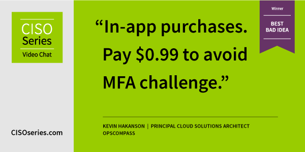
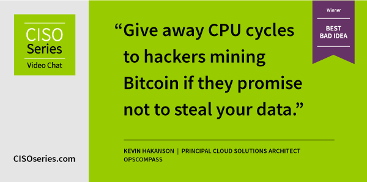
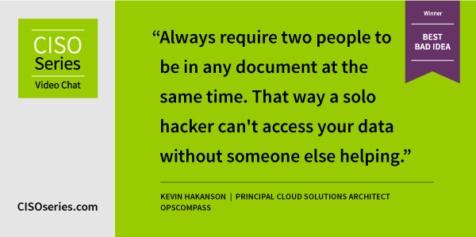
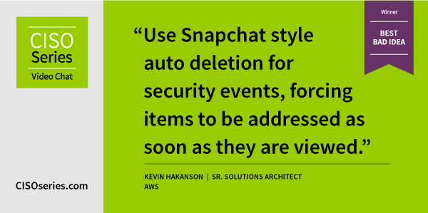
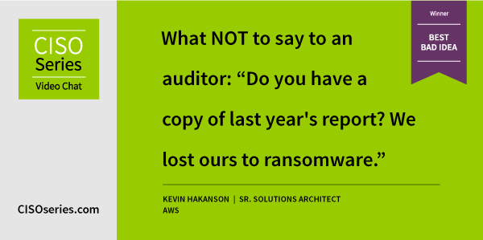
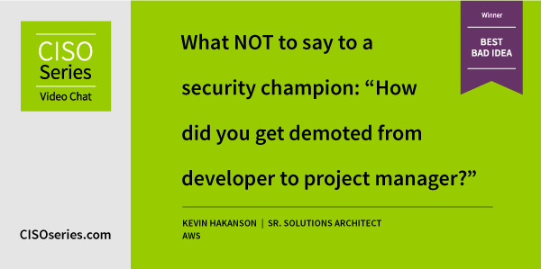

I receive a lot of enjoyment participating in the BEST BAD IDEA during [CISO Series](https://cisoseries.com/) Video Chat.  In the chat, attendees suggest bad ideas related to that weeks topic.  These are collected and used for various segments with the guests such as "Department of YES" where they have to agree with the idea,"Beat the BAD IDEA" where they need to implement compensating controls, or "What's Worse?" determining the worse of two bad ideas.  Each week the BEST bad idea wins an award and a really awesome CISO Series sweatshirt (repeat winners get a $25 Amazon gift card). 

## 2020-12-04 [Hacking User Access](https://cisoseries.com/best-moments-from-hacking-user-access-ciso-series-video-chat/)

Winner

## 2021-01-08 [Hacking Cyber Media](https://cisoseries.com/best-moments-from-hacking-cyber-media-ciso-series-video-chat/)

Honorable Mention

> Publishing a cyber story requires a cryptocurrency payment on a blockchain. Once published everyone that shares gets a cut of the profit.

## 2021-01-22 [Hacking High Profile Accounts](https://cisoseries.com/best-moments-from-hacking-high-profile-accounts-ciso-series-video-chat/)

Honorable Mention

> Sell ’15 minutes of fame’ insurance for when you might ‘go big’ on social media and need it.

## 2021-02-05 [Hacking Windows Security](https://cisoseries.com/best-moments-from-hacking-windows-security-ciso-series-video-chat/)

Winner

## 2021-02-12 [Hacking Cloud Collaboration Tools](https://cisoseries.com/best-moments-from-hacking-cloud-collaboration-tools-ciso-series-video-chat/)

Winner

## 2021-03-05 [Hacking Systemic Risk](https://cisoseries.com/best-moments-from-hacking-systemic-risk-ciso-series-video-chat/)

Honorable Mention

> When presented with risk, follow the Rules of Improv and AGREE then say ‘YES AND’ to assume even more risk.

> Make sure your Chief Risk Officer has anterograde amnesia and can then claim they don’t recall accepting it.

## 2021-03-12 [Hacking Board Metrics](https://cisoseries.com/best-moments-from-hacking-board-metrics-ciso-series-video-chat/)

Honorable Mention

> Treat all board meetings like the party game “Two Truths and a Lie” when giving metrics.

> Graphics showing board metrics should be in the style of M.C. Escher’s impossible perspectives.

## 2021-04-23 [Hacking Distractions](https://cisoseries.com/best-moments-from-hacking-distractions-ciso-series-video-chat/)

Winner

## 2021-05-07 [Hacking Cloud Access](https://cisoseries.com/best-moments-from-hacking-cloud-access-ciso-series-video-chat/)

Honorable Mention

> Embrace Chaos Engineering concepts to implement Chaos-Based Access Control (CBAC) instead of RBAC or ABAC.

## 2021-10-08 [Hacking Regulations](https://cisoseries.com/five-best-moments-from-hacking-regulations-ciso-series-video-chat) 

Winner

Honorable Mention

> What NOT to say to an auditor:  "Did you get the gift cards? I clicked the link last week."

## 2021-10-15 [Hacking Security Champions](https://cisoseries.com/five-best-moments-from-10-15-21-hacking-security-champions-ciso-series-video-chat/)

Winner

## 2021-10-22 [Hacking Ransomware](https://cisoseries.com/best-moments-from-hacking-ransomware-ciso-series-video-chat/)

Honorable Mention

> What NOT to say in ransomware negotiation: If you can fill out this vendor security assessment, I can get procurement to pay out.

> What NOT to say in ransomware negotiation: My cryptocurrency wallet private key is in that data. Can you decrypt it and send back to me?

## 2021-10-29 [Hacking Secure Access](https://cisoseries.com/best-moments-from-hacking-secure-access-ciso-series-video-chat/)

Honorable Mention

> Outsource every business function so that far fewer employees need secure access. Transfer risk to vendors.

> Build apartments in your office building and require employees to live there.

## 2021-11-05 [Hacking Asset Management](https://cisoseries.com/best-moments-from-hacking-asset-management-ciso-series-video-chat/)

Honorable Mention

> Make sure to plug in every USB drive you find so you can track it as an asset.

> Use 100% ephemeral assets so there is nothing to track.